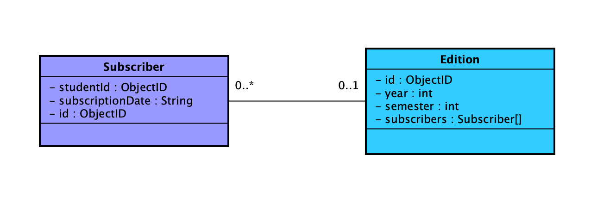

# constr-sw-P2

## Subindo o ambiente de dev

1. Entre na pasta **app**
2. Crie um arquivo **.env** e defina as seguintes variáveis: 

```
# General
PORT=<PORTA>

# Keycloak
BASE_URL=http://3.15.140.59:8080/auth
REALM_NAME=master

# Database
DB_DEV_HOST=localhost:27018
DB_NAME=database
```

* Caso seja necessário, altere os valores das variáveis para o seu ambiente.

3. Rode o comando ```npm i``` para instalar as dependências
4. Suba uma instância local do MongoDB com o comando ```docker-compose up```
    * Configura se a instância está rodando com o comando ```docker-compose ps```   
5. Inicialize o servidor com o comando ```npm start```

## Gerando documentação

Na pasta **app**, rode o comando ```npm run start-gendoc``` para criar outputFile para swagger.

## Modelos de dados

Esta API contém os dados das entidades ```Edition``` e ```Subscriber```.
Suas propriedades e relações podem ser observadas na imagem abaixo:

